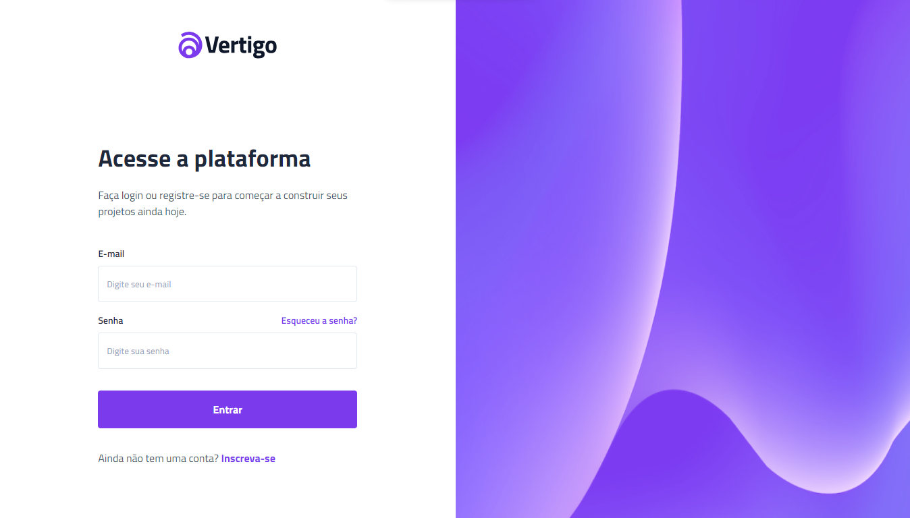
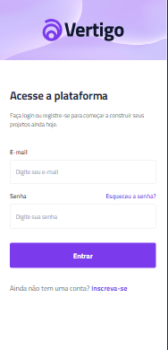

<h1 align="center">
    
</h1>

Welcome to my Vertigo project! This is a simple landing page for user authentication, built using HTML and CSS. The login page provides a clean and intuitive design for users to log in or register.

    </img>
    </img>

## Features 🌟

- **User-Friendly Interface:** The login page offers a straightforward and visually appealing interface.
  
- **Responsive Design:** The page is designed to be responsive, ensuring a seamless experience on various devices.
 

## Technologies Used 💻

- ✅ HTML

- ✅ CSS

Made with ♥ by MATHEUS PC :wave: [Get in Touch!](https://www.linkedin.com/in/matheus-estevan-38018a297)